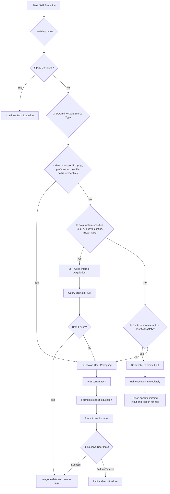

# Technical Specification: GEPA Unified Error Prevention and Data Acquisition Policy

**Document ID:** GEPA-SPEC-2024-001
**Status:** PROPOSED
**Author:** mutation_sweeper Agent
**Supersedes:** Provides clarifying logic for `policy-missing-input-handler`, `missing_data_acquisition_mechanism`, and `data-availability-for-content-generation-policy`.

## 1. Introduction & Goal

This document specifies the technical logic for a new GEPA error prevention rule for the AROS Task Execution Policy. It resolves the operational conflict between policies that mandate immediate halting (`policy-missing-input-handler`) and those that mandate active data acquisition (`missing_data_acquisition_mechanism`).

The goal is to create a deterministic, efficient, and safe workflow for handling missing inputs, maximizing task completion rates while ensuring critical processes fail safely.

## 2. The GEPA Unified Rule

**GEPA-Rule-007: Context-Aware Input Resolution**

Upon detection of missing or incomplete inputs, an agent MUST follow a context-aware resolution workflow. Instead of defaulting to an immediate halt, the agent MUST first determine if the missing data is retrievable. If and only if data acquisition is determined to be infeasible, unsafe, or impossible within the current execution context, the agent MUST then halt and report the failure.

## 3. Technical Specification: Conditional Logic Flow

This conditional logic governs the decision-making process for any skill or workflow upon encountering a missing input.

### 3.1. Detailed Logic Steps

1.  **Input Validation:** As per `policy-missing-input-handler`, the absolute first step of any task is to validate the presence and format of all critical inputs.
2.  **Determine Data Source Type:** If validation fails, the agent's next step is not to halt, but to classify the *type* of missing data.
    *   **User-Specific Data:** Information that cannot be inferred or found in system memory and requires direct user intent. Examples: target filename for a new creation, subjective feedback, or security credentials.
    *   **System-Specific Data:** Information that might exist within the AROS ecosystem. Examples: a previously stored API key, a configuration value, a historical fact from `brain.db`.
    *   **Safety-Critical Context:** Any task flagged as `critical-safety` (e.g., modifying system files, running unsupervised background processes) or running in a non-interactive mode where a user prompt is impossible.
3.  **Execute Acquisition or Halt:**
    *   **3a. User Prompting:** If data is user-specific, the agent halts the *current operation*, but not the entire workflow. It uses the `MissingInputClarificationSkill` protocol to request the specific data from the user. If the user provides the data, the workflow resumes. If the user fails to provide the data, the workflow halts definitively.
    *   **3b. Internal Acquisition:** If data is system-specific, the agent uses the `missing_data_acquisition_mechanism` to query `brain.db` and relevant KIs. If the data is found, the workflow resumes. If not, the agent proceeds to the User Prompting (3a) step as a fallback.
    *   **3c. Fail-Safe Halt:** If the execution context is non-interactive or safety-critical, the agent MUST bypass acquisition attempts. It invokes the `policy-missing-input-handler` protocol to halt immediately and log a detailed error report. This is the mandatory path for ensuring system stability.

## 4. Implementation Guidelines

*   All skills must be tagged with an `execution-context` metadata field in their `SKILL.md`. Values can be `interactive` (default) or `non-interactive`.
*   The global task execution engine will be responsible for implementing the primary conditional logic described in section 3.
*   The error message for a Fail-Safe Halt (3c) must explicitly state *why* it did not attempt to acquire the missing data (e.g., "Execution halted due to missing `--input-file`. Data acquisition skipped because this is a non-interactive task.").

This specification provides a clear and robust framework for handling missing inputs that balances resilience with safety, unifying the existing AROS policies into a single, coherent strategy.
