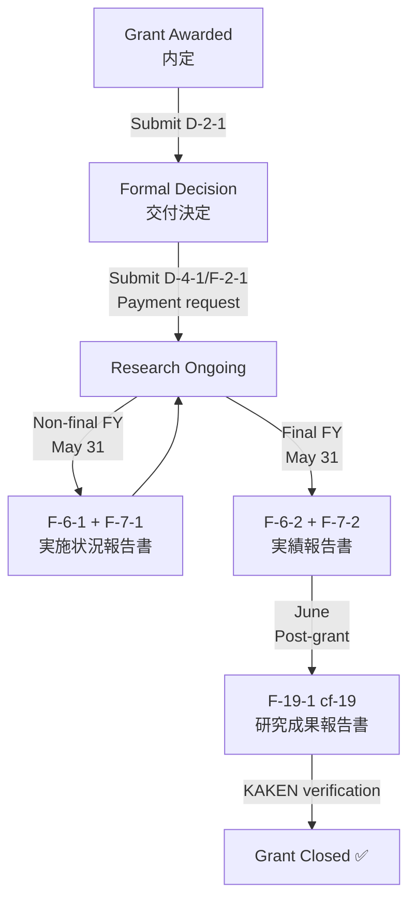

# KAKENHI_Pipeline — Universal KAKENHI Grant Management System

> **Version**: 2.0.0 | **Trigger**: `/kakenhi-annual-report`
> **Scope**: Any JSPS KAKENHI researcher · Any research field · Any grant level (研究活動スタート支援, 若手研究, 基盤研究B/C, 挑戦的研究, etc.)

This directory is a **reusable template library**. It contains zero hardcoded researcher or grant data. To use it for a specific grant, provide runtime variables from `ResearcherMetaInfo/{PI_FILE}.md` and `{GRANT_FOLDER}/Announcement_Rules/`.

---

## 1. Grant Lifecycle Decision Tree



> **Key Insight**: For 基金-type grants (スタート支援, 若手研究, 基盤研究B/C), the above decision tree governs all reporting. 補助金-type grants (基盤研究S, A, etc.) have a slightly different F-6 structure — always consult the local `Announcement_Rules/` files first.

---

## 2. Directory Structure

```
KAKENHI_Pipeline/
├── SPEC.md                                   ← Normative specification (read first)
├── README.md                                 ← This file
├── Workflows/
│   └── KAKENHI_annual_report_pipeline.md     ← Step-by-step lifecycle workflow
├── Skills/
│   ├── kakenhi-form-completion/SKILL.md      ← Form text generation logic
│   ├── researcher-data-collection/SKILL.md   ← 3-tier profile refresh
│   └── kakenhi-pre-award-forms/SKILL.md      ← D-series & F-2 forms
├── Policies/
│   ├── grant_report_policy.md                ← P1–P12 compliance policies
│   └── fact_check_policy.md                  ← Metadata verification rules
├── KIs/
│   ├── kakenhi_e_application_system/         ← e-Rad system guide + PDF manuals
│   ├── kakenhi_report_forms/                 ← Form codes + cf-19.docx template
│   └── publication_grant_map/               ← Attribution map structure guide
├── Templates/                                ← Empty scaffold files (copy to project)
│   ├── ResearcherMetaInfo_TEMPLATE.md
│   ├── Publication_Grant_Map_TEMPLATE.md
│   ├── XXKXXXXX_Achievements_List.md
│   ├── Metadata_Verification_TEMPLATE.md
│   └── Review_Rounds_Log_TEMPLATE.md
└── Tools/
    └── process_figures.py                    ← PDF figure extraction & auto-crop
```

---

## 3. How to Use This Pipeline for a New Grant

### Step 1: Set Up Grant Folder

Create a new grant folder at the workspace root:
```
{WorkspaceRoot}/{GRANT_FOLDER}/
```
Following the canonical structure defined in `SPEC.md §4`, the folder MUST contain:
```
{GRANT_FOLDER}/
├── Announcement_Rules/   ← Drop PDFs here
├── Application/
├── Management/
├── References/
│   ├── paper/
│   ├── 学会/
│   ├── figures/
│   │   └── audit/
│   ├── {GRANT_ID}_Achievements_List.md    ← Copy from Templates/XXKXXXXX_Achievements_List.md
│   └── Metadata_Verification.md           ← Copy from Templates/
└── Reports/
    └── cf-19.docx        ← Copy from KIs/kakenhi_report_forms/artifacts/
```

### Step 2: Initialize Researcher Profile

Copy `Templates/ResearcherMetaInfo_TEMPLATE.md` to:
```
{WorkspaceRoot}/ResearcherMetaInfo/{PI_NAME_EN}.md
```
Then run the **researcher-data-collection** skill to populate it.

### Step 3: Run the Pipeline

Trigger the workflow via the AROS slash command:
```
/kakenhi-annual-report
```
The workflow will read the runtime variables, select the correct form type (F-6-1/F-7-1 or F-6-2/F-7-2 or F-19-1), and produce bilingual draft documents.

---

## 4. Runtime Variable Reference

See `SPEC.md §2` for the full table of required variables. The most critical are:

| Variable | Where to Find It |
|----------|-----------------|
| `{GRANT_ID}` | 交付決定通知書 (in Announcement_Rules/) |
| `{GRANT_TYPE}` | 交付決定通知書 |
| `{DIRECT_COST_TOTAL}` | 交付決定通知書 |
| `{PI_NAME_EN}` | ResearcherMetaInfo/{PI_FILE}.md |
| `{PI_RESEARCHMAP_URL}` | ResearcherMetaInfo/{PI_FILE}.md |
| `{REPORT_FISCAL_YEAR}` | Current context (e.g., 2025 for reports filed May 2026) |

---

## 5. Policy Summary

| Policy | Rule |
|--------|------|
| **P1** | Attribute publications only to grants that genuinely funded them |
| **P2** | All funded publications must cite the grant number in acknowledgments |
| **P3** | PI name must be consistent across all databases and reports |
| **P4** | F-7-1/F-6-1 due **May 31**; F-7-2/F-6-2 due **May 31**; F-19-1 due **June** |
| **P5** | Budget categories must match 交付決定通知書 |
| **P6** | File naming: `{GRANT_ID}_{FY}_{FormCode}[_draft].{ext}` |
| **P7** | Local `Announcement_Rules/` files supersede all general JSPS web guidelines |
| **P8** | F-19-1 must cover the **entire** grant period, not just final year |
| **P9** | Researcher profile MUST be refreshed within 30 days before submission |
| **P10** | Every F-19-1 cf-19 MUST include ≥1 visually verified figure |
| **P11** | Cross-check KAKEN database before drafting F-19-1 |
| **P12** | All forms require 3-round dual-agent review (min 7/10 per dimension) |

---

## 6. AROS Sync Locations

| Component | Source | AROS Destination |
|-----------|--------|-----------------|
| Skills | `Skills/*/SKILL.md` | `~/.gemini/skills/` |
| Workflow | `Workflows/KAKENHI_annual_report_pipeline.md` | `~/.gemini/antigravity/global_workflows/` |
| Policies | `Policies/*.md` | `~/.gemini/antigravity/policies/` |
| KIs | `KIs/*/` | `~/.gemini/antigravity/knowledge/` |

To re-sync: run the AROS push commands documented at the end of `KAKENHI_annual_report_pipeline.md`.

---

---

*Last Updated: 2026-05-11 | KAKENHI_Pipeline v2.0.0*
