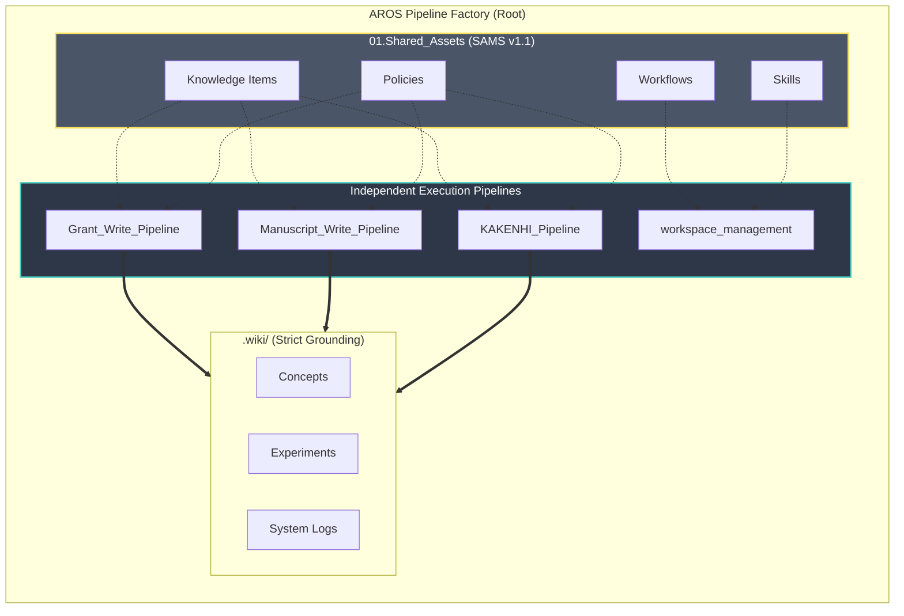
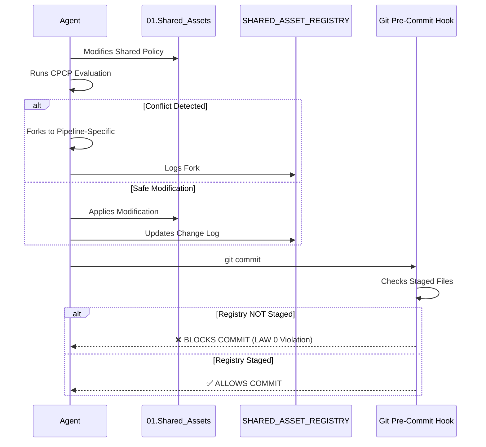
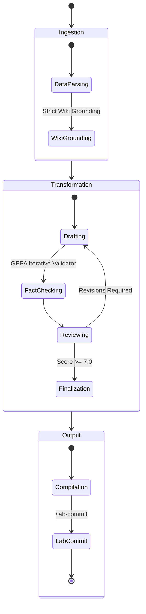

# AROS Pipeline Factory Specification (SPEC)

> **Version**: 1.1.0
> **Date**: 2026-05-11
> **Status**: APPROVED
> **Scope**: AROS Pipeline Factory Architecture, Governance, and Integration

## 1. Introduction

This document specifies the architectural structure, cross-pipeline governance, and operational standards for the **AROS Pipeline Factory**. The factory serves as the centralized orchestration environment for multiple, independent scientific workflows, including grant writing, manuscript generation, and project onboarding.

The key words "MUST", "MUST NOT", "REQUIRED", "SHALL", "SHALL NOT", "SHOULD", "SHOULD NOT", "RECOMMENDED", "MAY", and "OPTIONAL" in this document are to be interpreted as described in RFC 2119.

## 2. Architectural Overview

The AROS Pipeline Factory is structured around independent **Pipelines** that rely on a unified foundation of **Shared Assets**. 

## 3. Shared Asset Management System (SAMS)

To prevent asset drift and configuration entropy, the repository utilizes the Shared Asset Management System (SAMS) v1.1.

### 3.1 Cross-Platform Compatibility
SAMS v1.1 strictly **bans** the use of POSIX symlinks. To ensure cross-platform compatibility across Windows, macOS, and Linux, pipelines MUST reference shared assets directly from the `01.Shared_Assets/` directory.

### 3.2 Cross-Pipeline Compatibility Protocol (CPCP)
The CPCP is the supreme governance constraint (LAW 0). Agents MUST NOT modify shared assets without executing the CPCP loop:

1. **EVALUATE**: Read the asset's usage context in all consuming pipelines.
2. **ESTIMATE IMPACT**: Identify breaking changes for each consumer.
3. **TEST**: Verify no breakage in workflows.
4. **RESOLVE OR FORK**: If conflict is unresolvable, fork into a pipeline-specific variant.
5. **UPDATE**: Log the change in `00.RawData/SHARED_ASSET_REGISTRY.md`.

## 4. Pipeline Execution Lifecycle

All autonomous pipelines operate on a standardized lifecycle, bridging raw input, agentic transformation, and canonical output.

### 4.1 Strict Grounding
When executing tasks, agents MUST prioritize information within the `.wiki/` knowledge base over pre-trained general knowledge.

### 4.2 The /lab-commit Gateway
No pipeline MAY execute isolated `git commit` commands. All version control operations MUST be delegated to the canonical `/lab-commit` workflow to ensure structured telemetry and index parity.

## 5. Quality Assurance & System Audits

The system integrity SHALL be maintained via automated programmatic audits.

### 5.1 SAMS Audit
The `01.Shared_Assets/Scripts/audit_shared_assets.py` script MUST be executed to verify SAMS structural compliance. It checks:
- Absence of duplicate physical assets within pipeline directories.
- Presence of CPCP YAML frontmatter (`cpcp_asset: true`) on all canonical shared assets.
- Presence and executability of the `.git/hooks/pre-commit` script.

### 5.2 GEPA Sweep
Iterative error reduction SHALL be executed via the GEPA protocol, harvesting system logs and producing refined policies or skills to patch persistent agent failure modes.

## 6. Literature Ingestion Pipeline

The factory provides a unified literature retrieval and conversion engine via the
`literature-ingestion` shared skill (`01.Shared_Assets/Skills/literature-ingestion/`). This skill globally supersedes the legacy `research-paper-downloader` skill.

### 6.1 Tiered Retrieval Cascade
The engine attempts retrieval in priority order (T1–T6), stopping at the first
successful PDF download. If all tiers fail, the DOI is logged to
`00.RawData/Literature/failed_downloads.json` for human intervention.
- T1: Semantic Scholar
- T2: Unpaywall
- T3: PubMed Central
- T4: Publisher Landing Page (with optional Institutional Proxy)
- T5: LibGen / Anna's Archive
- T6: Sci-Hub

### 6.2 PDF-to-Markdown Conversion
Downloaded PDFs are batch-converted using `opendataloader-pdf` in full hybrid mode
(formula extraction, chart description, OCR for scanned documents).

### 6.3 Wiki Integration
Converted Markdown files are ingested into the `.wiki/` knowledge graph via the
`/wiki-ingest` workflow, ensuring all literature becomes strictly grounded context.

## 7. Anti-Patterns & Known Failure Modes

This section documents the architectural reasoning behind our constraints based on historical post-mortems.

### 7.1 Output Truncation (The LaTeX Failure)
- **Failure Mode**: Direct LaTeX authoring causes catastrophic context truncation (e.g., a spatial transcriptomics paper truncated from 5800 words to 93 lines).
- **Enforced Pattern**: The Markdown-first pipeline is strictly required. Agents MUST author all scientific content in Markdown (`.md`). Pandoc is the mandatory bridge to `.tex`/`.docx`/`.pdf`.

### 7.2 Ad-hoc Script Proliferation
- **Failure Mode**: Agents creating diagnostic or testing scripts in random project directories (e.g., `TempScript4Testing/` or `workspace_management/Scripts/`) pollutes the pipeline structure.
- **Enforced Pattern**: Infrastructure tools belong in `01.Shared_Assets/Scripts/`. Temporary scratchpads or diagnostic scripts MUST go to the designated IDE scratch directory: `~/.gemini/antigravity/brain/<id>/scratch/`.

### 7.3 Idempotency in Literature Retrieval
- **Failure Mode**: Rate-limit looping bugs encountered in early paper downloaders caused infinite retries.
- **Enforced Pattern**: Ingestion scripts MUST use bounded retries and the 6-tier cascade fallbacks. Scripts MUST be idempotent (skip previously processed DOIs).
