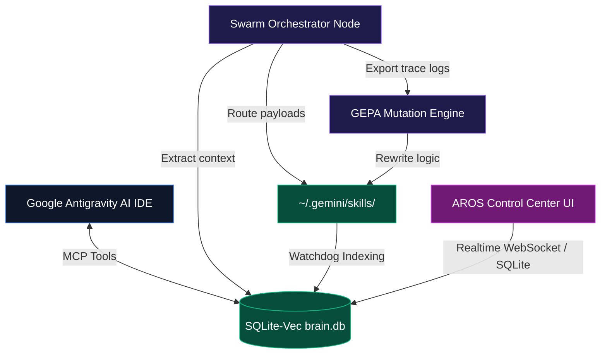
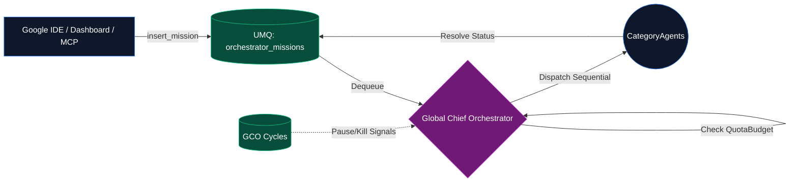
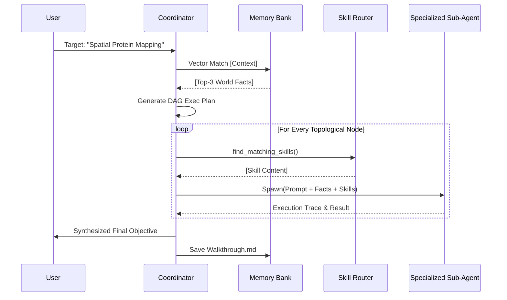
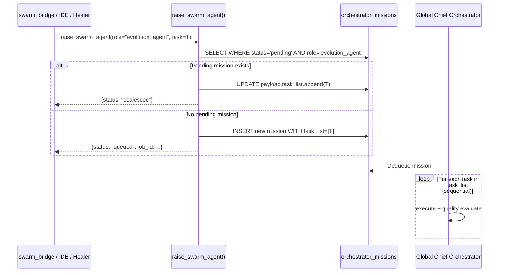
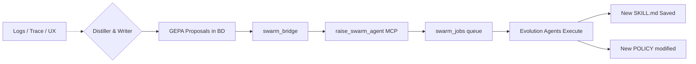

# Antigravity Research OS (AROS) Specification
**Version:** 2.6 | **Codename:** MTL Eight-Pillar Hardening

AROS is a hyper-autonomous, OS-integrated multi-agent operating system designed specifically for bioinformatics, molecular mapping, and generative science. It breaks the bounds of standard LLM wrappers by natively plugging into a unified **Vector Memory Bus (brain.db)**, dynamically deploying **Swarm Agents** over acyclic computational graphs, and continuously rewriting its own logic via the **GEPA Evolution Engine**.

---

## 1. Vision & Mission
**Vision:** To orchestrate an endless loop of scientific discovery where computational agents hold long-term context, self-correct through environmental feedback, and flawlessly coordinate multi-modality pipeline execution (e.g., Spatial Transcriptomics into Metaproteomics) as easily as running a single shell script.

**Mission:**
1. **Zero-Hallucination Execution:** Ground every agent in verified `world_facts` loaded efficiently via native vector similarity.
2. **Federated Swarm Intelligence:** Break down impenetrable scientific barriers by running specialized model-tiers in parallel, seamlessly handing unstructured data flows between nodes.
3. **Continuous OS Mutation (GEPA):** Automatically identify failures in execution logs, trace the root cause, and rewrite the skill/policy libraries in the background so the same error is never encountered twice.

---

## 2. Global Architecture

The AROS ecosystem functions through three heavily integrated, asynchronous layers.

> [!NOTE]
> The entire ecosystem operates on `sqlite-vec` mappings locally mapped into Python using pre-compiled floating point vector packing. This guarantees millisecond ingestion times without needing to pass telemetry over the wire to third-party databases.

---

## 3. The Swarm Orchestrator (DAG Logic)

The *Swarm* sits at the heart of the execution loop. Powered by a combination of Top-Tier orchestration modeling (`gemini-3.1-pro-preview`) and specialized sequential workers (`gemini-2.5-pro` and `gemini-2.5-flash`), it performs zero-shot MapReduce over scientific objectives. 

### Universal Sequential Mission Queue (UMQ) & GCO
To eliminate API Rate Limiting (429) bottlenecks and strictly balance LLM Context Tokens, all agent requests traverse a **Universal Mission Queue**. A daemonized singleton, the **Global Chief Orchestrator (GCO)**, governs routing.

### Sub-Agent Execution Flow

### One-Agent-Per-Role Principle (v2.4)

To prevent runaway agent spawning cascades, a **Role Coalescing Guard** is enforced at the `raise_swarm_agent()` gateway.

**Rule:** At any moment, at most **one pending or active agent per `agent_role`**. New tasks for an already-queued role are merged into the existing mission's `task_list` — not spawned as separate agents.

---

### Components:
- **`model_selector.py`:** Ruleset that binds agents to the right tier, saving massive token pricing. Orchestrators use tier 1, Analysts use tier 2, Data Cleaners use tier 3.
- **`skill_router.py`:** A hybrid vector/keyword algorithm. Searches `vec_world_facts` for matching skill definitions in the underlying `.gemini/` system to physically inject them into the sub-agent parameter.
- **`agent_taxonomy.py`:** An organic registry of agent archetypes. Seeded via hard-coded classes, but mutated daily by GEPA depending on the availability of skills.
- **`session.py` (Artifact Service):** Enforces separation of "Brain and Hands" via durable Session isolation. Manages the lifecycle of a DAG pipeline by saving huge text/data output to unique job scratch directories, passing lightweight *file paths* down the pipeline instead of raw string payloads to prevent token context exhaustion ("Context Anxiety").

---

## 4. Tracing, Distillation & The GEPA Engine

The **GEPA Engine (Generative Evolutionary Python Architecture)** creates a closed-loop learning cycle, seamlessly integrated through the system's Swarm Operations. Every time an agent fails parsing, encounters a pipeline exception, hallucinates an output schema, or successfully distills conversation chat logs, the following occurs:

At 03:00 local time (or forced via the dashboard's "Distill Knowledge" -> "Execute" button), the GEPA system sweeps all logs. It leverages qualitative DSPy evaluation threshold limits (ScholarEval dimensions) to assess whether a systemic rewrite of the system rules (`AGENTS.md`) or individual component constraints is required. 

**Decoupled Swarm Operations:**
Distilled knowledge proposals do NOT block the UI. `swarm_bridge.py` dynamically delegates proposals as daemon tasks by calling `raise_swarm_agent`. This completely decouples UI operations from large agent-team computation by tracking all spawned Background Agents directly inside the `swarm_jobs` SQLite database table. The AROS Control Center then natively updates with the Swarm's asynchronous operation events.

> [!WARNING]
> Because GEPA physically rewrites `SKILL.md` content on disk, it acts as a dynamic defense net. An agent encountering an Ensembl FASTA alignment error on Tuesday will trigger GEPA on Wednesday, guaranteeing Thursday's agents include an explicit hard-coded prompt fix for that alignment edge-case.

---

## 5. Eight-Pillared Memory Transfer Learning (MTL) Bank `(antigravity_brain)`

A specialized RAG-integrated vector system managed by `dreamer.py` and indexed inside `brain.db`. It powers the **Ambient Screener**, which injects a massive 8-field multi-modal context payload into the IDE pre-flight via an asynchronous, non-blocking MCP interface.

| Memory Type | Structure | Lifecycle | Purpose |
| :--- | :--- | :--- | :--- |
| **World Facts** | High-Confidence semantic extractions (`vec_world_facts`) from documentation. | Highly mutable via GEPA. Permanently held. | Replaces base LLM hallucinations. Anchors the agent dynamically prior to execution. |
| **Experiences** | Episodic Memory. Complete timeline logs. | Decays over TTL unless reinforced. | Contextual hindsight mapping across parallel workspace sessions. |
| **Mental Models** | Highly distilled heuristic boundaries. | Slowly established via recurring trace events. | Enhances autonomous decision threshold boundaries in non-deterministic science paths (e.g., parameter tuning). |
| **Skills** | Actionable scripts mapped via `KIWorkflowIndex`. | Dynamically indexed from `~/.gemini/skills/`. | Direct function execution code injected into agents. |
| **Policies** | Behavioral constraints mapped via `KIWorkflowIndex`. | Subset of skills matching `policy` keyword. | Guides ethical and structural boundaries of execution. |
| **KIs** | Distilled Knowledge Items. | Semantically retrieved. | Core project context and architectures. |
| **Workflows** | Multi-step DAG sequences. | Semantically retrieved. | Pre-approved pathways for complex multi-agent tasks. |
| **Agents** | The taxonomy of Swarm roles. | Semantically retrieved. | Directs the IDE to the optimal agent persona for the task. |

> [!TIP]
> **Composite Cache Key Design:** The `ambient_screener.py` session cache is keyed
> on `session_id + SHA-256(user_message)[:6]`. This prevents cross-prompt cache
> pollution when the IDE uses the same `session_id = "default"` for every turn.
> Identical prompts within 5 minutes still benefit from the TTL cache; distinct
> prompts always trigger a fresh eight-field retrieval sweep.

> [!TIP]
> **Non-Blocking MCP Architecture:** All MCP tool handlers are `async`. Synchronous
> blocking calls (`get_embedding()`, cosine similarity, SQLite queries) are wrapped
> with `asyncio.to_thread()` so the event loop stays responsive. SQLite connections
> are always opened **inside** the worker thread — never passed across thread
> boundaries — to respect SQLite's per-thread connection model (PEP 249 §2.2).
> This permanently resolves the `client is closing: EOF` timeouts.

> [!TIP]
> **No Folder Separation Needed:** Skills and Policies are both housed in `~/.gemini/skills/`.
> The `KIWorkflowIndex` natively builds separate internal semantic indices by parsing
> the keyword `policy` in the directory name, eliminating physical folder overhead
> while maintaining flawless context separation.

---

## 6. Dashboard Telemetry UI

To escape terminal isolation, AROS ships with a pure glass-morphism WebSocket integrated dashboard (`uvicorn src.antigravity_dashboard.main:app`).

### Features
1. **Live Mutation Trace Logistics:** Instead of generalized graphics, the core telemetry dynamically scrolls through every GEPA element modified (`[SKILL]`, `[KI]`, `[WORKFLOW]`, `[POLICY]`), connecting OS state to human visual tracking.
2. **Memory Constellation Engine:** A hyper-responsive `vis.js` force-directed node graph showcasing the physical gravity layers linking World Facts to Master KIs.
3. **MCP Controller GUI:** Instant configuration panel to securely federate external connections (Omni-channel UniProt, GitHub, Kosmos) directly back into the Agent IDE.

---
### **Status:** ACTIVELY ONLINE - `exit code: 0`
The AROS specification ensures endless extensibility for AI agent scientific collaboration, successfully blending immutable human coding paradigms with generative, self-evolving system design.
